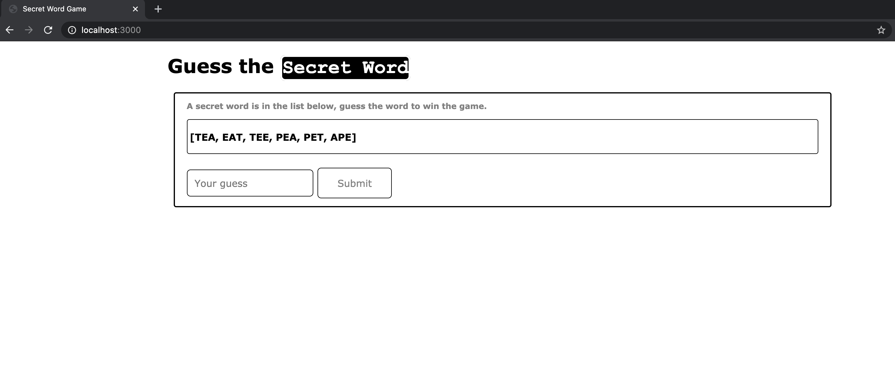
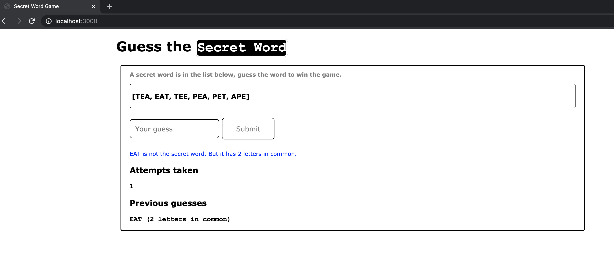
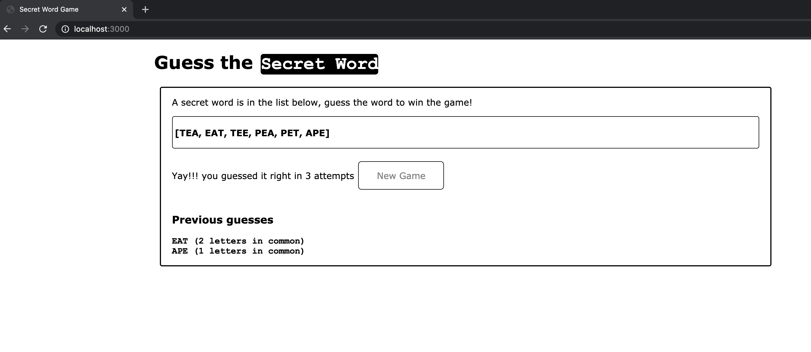

# Guess the Secret Word
A word guessing game that runs on web-browsers. A web-server manages the game play. 

## How to play?
* When the game starts, a list of words are shown to the player.
* Server picks one of the words in the list as the __secret__ word, which is unknown to the player.
* The player picks a word from the list as a _guess_.
* If the _guess_ is correct, the player wins. 
* If the _guess_ is wrong, a count of common letters between the __secret__ and the _guess_ words is shown.

For instructions to setup the game server see Run Game Server.
Open the game page on a web browser at [http://localhost:3000/](http://localhost:3000/).

## Technical details
* The game server is built on JS and runs on NodeJS.
* The game page uses html and CSS.
* The game server works for multiple players.
* The game is case-insensitivity.

__External libraries__
* express.js
* cookie-parser

### Run Game Server
* Download this repository.
* Open folder word-guessing-game/ from the repository on terminal.
* Run `npm install` and then `node server.js`.

### Customize words
* Add more words to __words.js__.
* All words in the file should be of the same length.

## Game screen caps

__Game Start__

__Game Play__

__End of Game__

